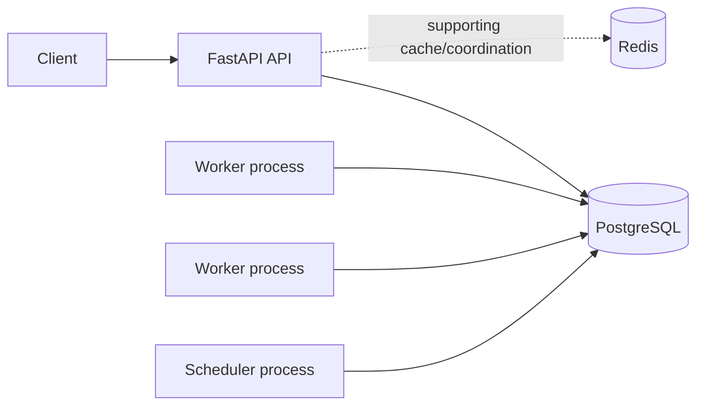

# Architecture

FastAPI serves the HTTP API. PostgreSQL is the durable source of truth for users, organizations, queues, jobs, execution history, logs, workers, schedules, and the dead-letter queue. Redis is included for supporting coordination, caching, and future rate limiting; it is never required to determine persistent job state.

The API, worker, and scheduler are separate processes. This keeps execution independent from request handling and permits horizontal worker scaling.
