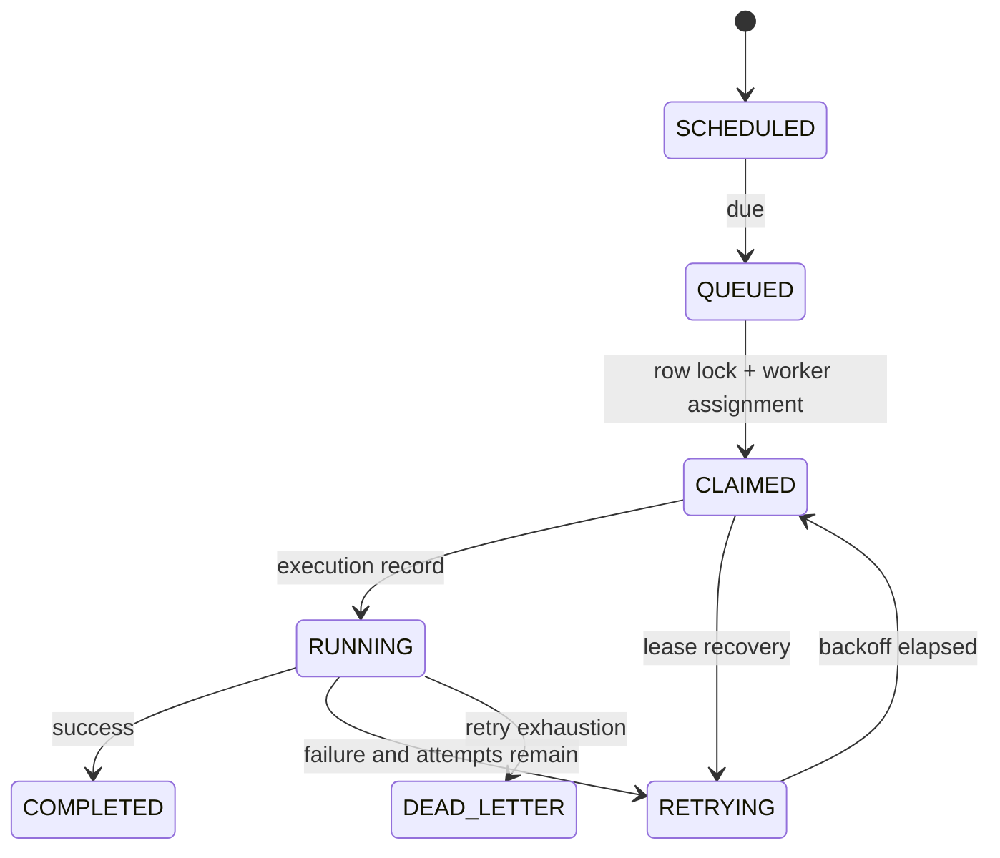

# Job lifecycle

The database is authoritative. Claiming uses a transaction and `FOR UPDATE SKIP LOCKED`, so competing workers cannot claim the same row. Execution is at-least-once: a worker crash can cause a previously started task to run again after lease recovery. Exactly-once execution is not claimed.
