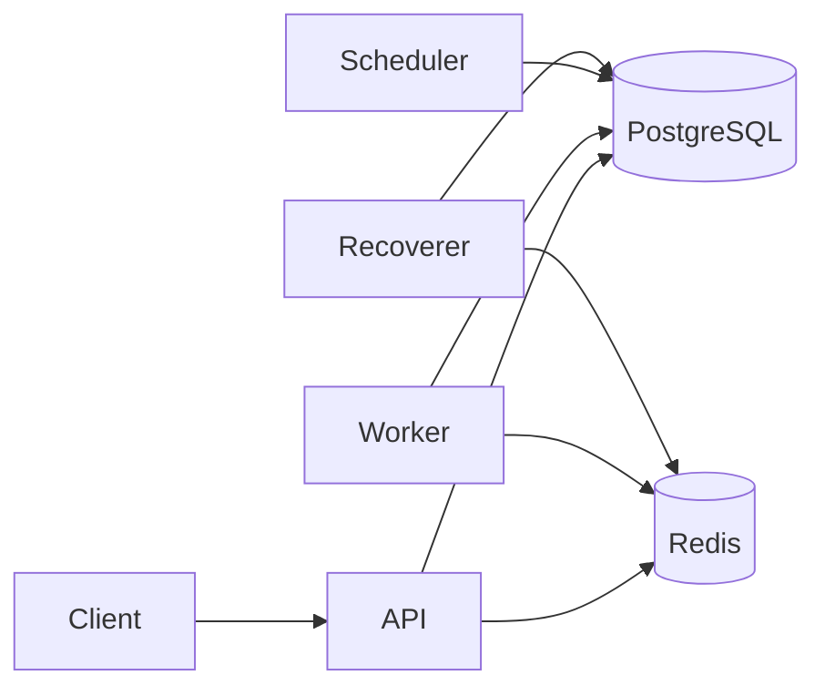

# Architecture

## Objective

Authenticated users manage organizations, projects, and queues, then submit immediate, delayed, scheduled, cron, and batch jobs. Multiple worker processes claim and execute jobs without duplicate claims. PostgreSQL is the source of truth for persistent job state.

## Component diagram



| Process | Responsibility |
| --- | --- |
| **API** | Auth, CRUD, job ingest, inspection, metrics/health |
| **Worker** | Heartbeats, atomic claim, execute, logs, retries |
| **Scheduler** | Promote due delayed/scheduled/cron work into `QUEUED` |
| **Recoverer** | Requeue abandoned claims when worker leases expire |

These may share a codebase and run as separate Docker services (`api`, `worker`, `scheduler`; recoverer can be a scheduler loop or a dedicated process).

## PostgreSQL vs Redis

| Concern | Store | Why |
| --- | --- | --- |
| Users, orgs, jobs, executions, DLQ, schedules | PostgreSQL | Durability, FKs, transactions, `FOR UPDATE SKIP LOCKED` |
| Rate limiting, request idempotency cache (optional short TTL) | Redis | Ephemeral, fast |
| Worker live presence / pubsub notifications (optional) | Redis | Not required for correctness |
| Job payload and status | **Not Redis** | Restart must not lose or desync jobs |

Redis is never the source of truth for job coordination.

## Proposed repository layout

```
scheduler-backend/
  app/
    main.py                 # FastAPI factory
    api/                    # routers only; thin handlers
      deps.py               # DI: db session, current user, settings
      v1/
        auth.py
        orgs.py
        projects.py
        queues.py
        jobs.py
        batches.py
        dlq.py
        workers.py
        stats.py
        health.py
    core/
      config.py
      security.py           # JWT, Argon2
      errors.py
      logging.py
      rbac.py
    models/                 # SQLAlchemy 2 mapped classes
    schemas/                # Pydantic v2
    repositories/
    services/               # business logic
    jobs/
      state_machine.py
      claiming.py           # SKIP LOCKED claim
      retry.py
      recovery.py
    scheduler/
      service.py
      cron.py
    worker/
      process.py
      heartbeat.py
      executor.py
      concurrency.py
    tasks/                  # registered task types only (echo, http, …)
    metrics.py
  alembic/
  tests/
    unit/
    integration/            # concurrent claim, concurrency limits, recovery
  docker-compose.yml
  Dockerfile
  docs/
```

Dependency injection: FastAPI `Depends` for settings, DB session, current user, repositories/services constructed per request. Worker/scheduler construct the same services with an explicit session factory—no process-global job maps.

## API structure (v1)

Base: `/api/v1`. Auth: `Authorization: Bearer <jwt>`. Pagination: `page` + `limit` (max 100) plus filters/sort on list endpoints. Errors:

```json
{ "error": { "code": "QUEUE_NOT_FOUND", "message": "Queue does not exist", "details": {} } }
```

| Area | Methods |
| --- | --- |
| Auth | `POST /auth/register`, `POST /auth/login`, `GET /auth/me` |
| Orgs | CRUD + members (roles: OWNER, ADMIN, DEVELOPER, VIEWER) |
| Projects | `POST/GET/PATCH/DELETE /projects`, `GET /projects/{id}` |
| Queues | CRUD under project; `POST /queues/{id}/pause|resume`; stats |
| Jobs | create (type in body), get, list, cancel, retry, logs, executions |
| Batches | create, get progress |
| DLQ | list, get, retry, delete |
| Workers | list, get, heartbeats |
| System | `GET /health`, `GET /ready`, `GET /metrics` (basic) |

Isolation: every resource is reached through org membership. VIEWER is read-only; mutating job/queue APIs require DEVELOPER+.

## Delivery semantics

**At-least-once execution.** A job may run more than once if a worker dies after starting work but before a durable completion write, or if recovery requeues a lease that was still finishing. Idempotency keys prevent duplicate *creation*, not duplicate *execution*. We do **not** claim exactly-once processing.

## Incremental phases (after approval)

1. Config, Docker Compose (Postgres/Redis), Alembic models/migrations, health
2. Auth, orgs, projects, RBAC isolation + tests
3. Queues, retry policies, pause/resume
4. Job ingest + state machine + listing
5. Atomic claim + worker + task registry + concurrency tests
6. Retry, DLQ, execution history, logs
7. Scheduler (delay/schedule/cron) + recovery
8. Batches, stats, rate limit, OpenAPI polish
