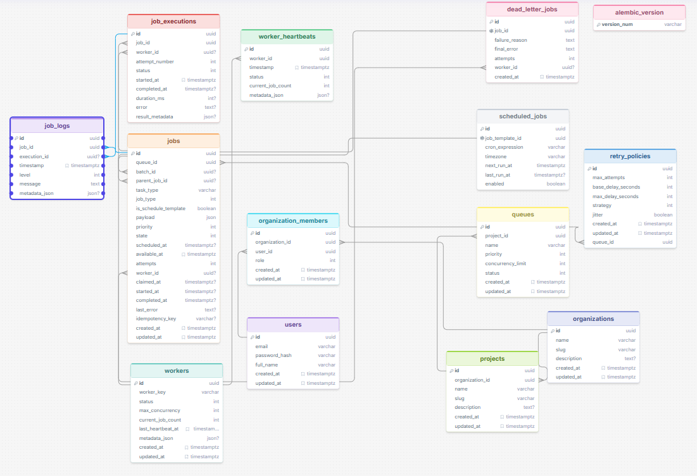

# Database

PostgreSQL 16+. UUID primary keys (`uuidv7` if available, else `gen_random_uuid()`). `created_at` / `updated_at` on all tables. Alembic-only schema changes; **no** `create_all` on production startup.

## ER overview

## ER Diagram



## Tables

### users

| Column | Notes |
| --- | --- |
| id UUID PK | |
| email CITEXT UNIQUE NOT NULL | |
| password_hash TEXT NOT NULL | Argon2; never plaintext |
| is_active BOOLEAN | |
| created_at, updated_at | |

### organizations

| Column | Notes |
| --- | --- |
| id UUID PK | |
| name TEXT NOT NULL | |
| slug TEXT UNIQUE NOT NULL | |
| created_at, updated_at | |

### organization_members

| Column | Notes |
| --- | --- |
| id UUID PK | |
| organization_id FK | ON DELETE CASCADE |
| user_id FK | ON DELETE CASCADE |
| role TEXT NOT NULL | CHECK IN (`OWNER`,`ADMIN`,`DEVELOPER`,`VIEWER`) |
| UNIQUE (organization_id, user_id) | |

### projects

| Column | Notes |
| --- | --- |
| id UUID PK | |
| organization_id FK | ON DELETE CASCADE |
| name TEXT NOT NULL | |
| description TEXT | |
| UNIQUE (organization_id, name) | |

### retry_policies

Reusable policy rows (queue default and optional per-job override).

| Column | Notes |
| --- | --- |
| id UUID PK | |
| organization_id FK | |
| name TEXT | |
| strategy TEXT | CHECK `FIXED`,`LINEAR`,`EXPONENTIAL` |
| max_attempts INT CHECK > 0 | |
| base_delay_seconds INT CHECK >= 0 | |
| max_delay_seconds INT | |
| jitter_ratio NUMERIC | 0–1 |

### queues

| Column | Notes |
| --- | --- |
| id UUID PK | |
| project_id FK | ON DELETE CASCADE |
| retry_policy_id FK | NOT NULL |
| name TEXT NOT NULL | |
| priority INT NOT NULL | Higher claimed first |
| concurrency_limit INT NOT NULL CHECK >= 1 | |
| status TEXT | CHECK `ACTIVE`,`PAUSED` |
| UNIQUE (project_id, name) | |

Index: `(project_id, status)`.

### batches

| Column | Notes |
| --- | --- |
| id UUID PK | |
| project_id FK | |
| name TEXT | |
| created_by FK users | |

Progress is computed from child jobs (counts by status), not denormalized as the sole truth. Optional cached counters updated in the same transaction as job terminal states.

### jobs

| Column | Notes |
| --- | --- |
| id UUID PK | |
| queue_id FK | |
| batch_id FK NULL | |
| created_by FK users | |
| type TEXT | `IMMEDIATE`,`DELAYED`,`SCHEDULED`,`CRON`,`BATCH_CHILD` |
| task_name TEXT NOT NULL | Must exist in worker task registry |
| payload JSONB NOT NULL | Validated; never eval’d |
| priority INT | Inherited/overridable |
| status TEXT | See job-lifecycle |
| idempotency_key TEXT NULL | |
| run_after TIMESTAMPTZ NOT NULL | Eligible when `now() >= run_after` |
| claimed_at, started_at, completed_at | |
| lease_expires_at TIMESTAMPTZ | Recovery |
| worker_id FK NULL | |
| attempt_count INT NOT NULL DEFAULT 0 | |
| last_error TEXT | |
| UNIQUE (queue_id, idempotency_key) WHERE idempotency_key IS NOT NULL | |

**Claim index (critical):**

```sql
CREATE INDEX jobs_claim_idx ON jobs (queue_id, priority DESC, run_after, created_at)
  WHERE status IN ('QUEUED', 'RETRYING');
```

Partial indexes for list filters: `(queue_id, status)`, `(worker_id)`, `(created_at)`, `(batch_id)`.

CHECK: `run_after` required; `attempt_count >= 0`.

### scheduled_jobs

Cron / calendar schedules that *spawn* or *re-queue* jobs.

| Column | Notes |
| --- | --- |
| id UUID PK | |
| queue_id FK | |
| job_template JSONB | task_name, payload, priority, retry override |
| cron_expression TEXT NULL | Required if recurring |
| timezone TEXT DEFAULT 'UTC' | |
| next_run_at TIMESTAMPTZ NOT NULL | |
| last_run_at TIMESTAMPTZ | |
| last_enqueued_run_at TIMESTAMPTZ | Idempotency for this fire |
| enabled BOOLEAN | |
| UNIQUE (id, last_enqueued_run_at) pattern via advisory or unique on (id, fire_identity) | |

Prevent duplicate cron generation with a unique `schedule_fire` table: `(scheduled_job_id, fire_at)` UNIQUE.

### job_executions

Append-only attempts. Never overwrite.

| Column | Notes |
| --- | --- |
| id UUID PK | |
| job_id FK | |
| worker_id FK | |
| attempt_number INT | UNIQUE (job_id, attempt_number) |
| status TEXT | |
| started_at, completed_at | |
| duration_ms INT | |
| error TEXT | |
| result JSONB | |

### job_logs

| Column | Notes |
| --- | --- |
| id UUID PK | |
| job_id FK | |
| execution_id FK | |
| timestamp TIMESTAMPTZ | |
| level TEXT | `DEBUG`,`INFO`,`WARNING`,`ERROR` |
| message TEXT | |
| metadata JSONB | |

Index: `(job_id, timestamp)`, `(execution_id)`.

### workers

| Column | Notes |
| --- | --- |
| id UUID PK | Worker identity (also env `WORKER_ID`) |
| hostname TEXT | |
| status TEXT | `STARTING`,`HEALTHY`,`DRAINING`,`OFFLINE` |
| max_concurrency INT | |
| current_job_count INT | |
| last_heartbeat_at TIMESTAMPTZ | |
| metadata JSONB | |

### worker_heartbeats

History of beats (retain/prune). Latest may also live on `workers.last_heartbeat_at`.

| Column | Notes |
| --- | --- |
| id UUID PK | |
| worker_id FK | |
| timestamp TIMESTAMPTZ | |
| status TEXT | |
| current_job_count INT | |
| metadata JSONB | |

Index: `(worker_id, timestamp DESC)`.

### dead_letter_jobs

| Column | Notes |
| --- | --- |
| id UUID PK | |
| job_id FK UNIQUE | Original job remains, status `DEAD_LETTER` |
| queue_id FK | |
| failure_reason TEXT | |
| final_error TEXT | |
| attempts INT | |
| last_worker_id FK | |
| last_execution_id FK | |
| moved_at TIMESTAMPTZ | |

## Invariants (DB + app)

- Membership uniqueness per org/user.
- Queue name unique per project.
- Job idempotency unique per queue when key present.
- Claim only via transactional `SKIP LOCKED` (application).
- Execution attempt numbers unique per job.
- Cron fire unique per `(scheduled_job_id, fire_at)`.
