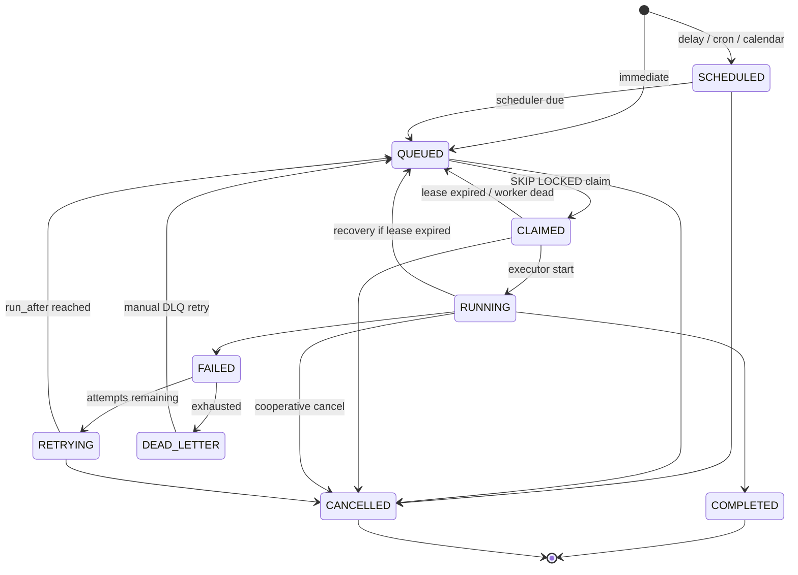

# Job lifecycle

Internal clocks are **UTC**.

## States

`SCHEDULED` → `QUEUED` → `CLAIMED` → `RUNNING` → `COMPLETED`  
Failures: `RUNNING` → `FAILED` → `RETRYING` → `QUEUED` (via `run_after`) or `DEAD_LETTER`  
Cancel: non-terminal → `CANCELLED` (not from `COMPLETED` / `DEAD_LETTER`).



## Valid transitions

| From | To | Actor |
| --- | --- | --- |
| (create immediate) | QUEUED | API |
| (create delayed/scheduled) | SCHEDULED | API |
| SCHEDULED | QUEUED | Scheduler (`now >= run_after` / cron fire) |
| QUEUED | CLAIMED | Worker claim txn |
| CLAIMED | RUNNING | Same worker, start execution row |
| RUNNING | COMPLETED | Worker success |
| RUNNING | FAILED | Worker exception / non-zero task error |
| FAILED | RETRYING | Retry engine (sets `run_after`) |
| RETRYING | QUEUED | Scheduler or claim eligibility (`status IN QUEUED,RETRYING` both claimable when `run_after <= now`) |
| FAILED | DEAD_LETTER | Retry exhausted |
| CLAIMED/RUNNING | QUEUED | Recoverer (abandoned lease) |
| *non-terminal* | CANCELLED | API |
| DEAD_LETTER | QUEUED | DLQ retry API (new attempt budget) |

Implementation note: `RETRYING` may be stored as `QUEUED` with `attempt_count > 0` and future `run_after`. Prefer an explicit `RETRYING` status for observability; claim SQL treats `QUEUED` and `RETRYING` as eligible when due.

## Invalid (must reject)

- COMPLETED → any (except none)
- CANCELLED → any
- QUEUED → RUNNING (must claim first)
- CLAIMED → COMPLETED (must enter RUNNING and write execution)
- Any → CLAIMED except from QUEUED/RETRYING
- Cross-job claim reuse
- Decrementing `attempt_count`

Enforced in `jobs/state_machine.py` **and** by updating `WHERE status = expected` so lost races fail closed.

## Claim algorithm

```sql
UPDATE jobs
SET status = 'CLAIMED',
    worker_id = :worker_id,
    claimed_at = now(),
    lease_expires_at = now() + :lease
WHERE id = (
  SELECT j.id
  FROM jobs j
  JOIN queues q ON q.id = j.queue_id
  WHERE q.id = :queue_id
    AND q.status = 'ACTIVE'
    AND j.status IN ('QUEUED', 'RETRYING')
    AND j.run_after <= now()
    AND (
      SELECT count(*) FROM jobs r
      WHERE r.queue_id = q.id AND r.status IN ('CLAIMED', 'RUNNING')
    ) < q.concurrency_limit
  ORDER BY j.priority DESC, j.run_after ASC, j.created_at ASC
  FOR UPDATE SKIP LOCKED
  LIMIT 1
)
RETURNING *;
```

Queue concurrency is enforced **inside the same transaction** as the claim so two workers cannot both ignore a limit of 5. Count of `CLAIMED`+`RUNNING` is serialized by row locks on candidate jobs plus the skip-locked selection; remaining races are closed by a second check: abort claim if count would exceed limit (re-read under lock on a `queue_leases` advisory lock per `queue_id` if needed).

Preferred extra serialization: `pg_advisory_xact_lock(hashtext(queue_id::text))` only around the concurrency count, **or** a `queue_runtime` row `FOR UPDATE` holding `running_count`. Documented choice: **per-queue runtime row** updated atomically with claim/complete to make limits testable and exact.

## Tests that must exist (not written yet)

- Two concurrent workers, one job → one `CLAIMED`, one empty
- N workers, N jobs → each job claimed once
- `concurrency_limit=5` → never 6 `RUNNING`+`CLAIMED` for that queue
- Invalid transition raises and leaves row unchanged
