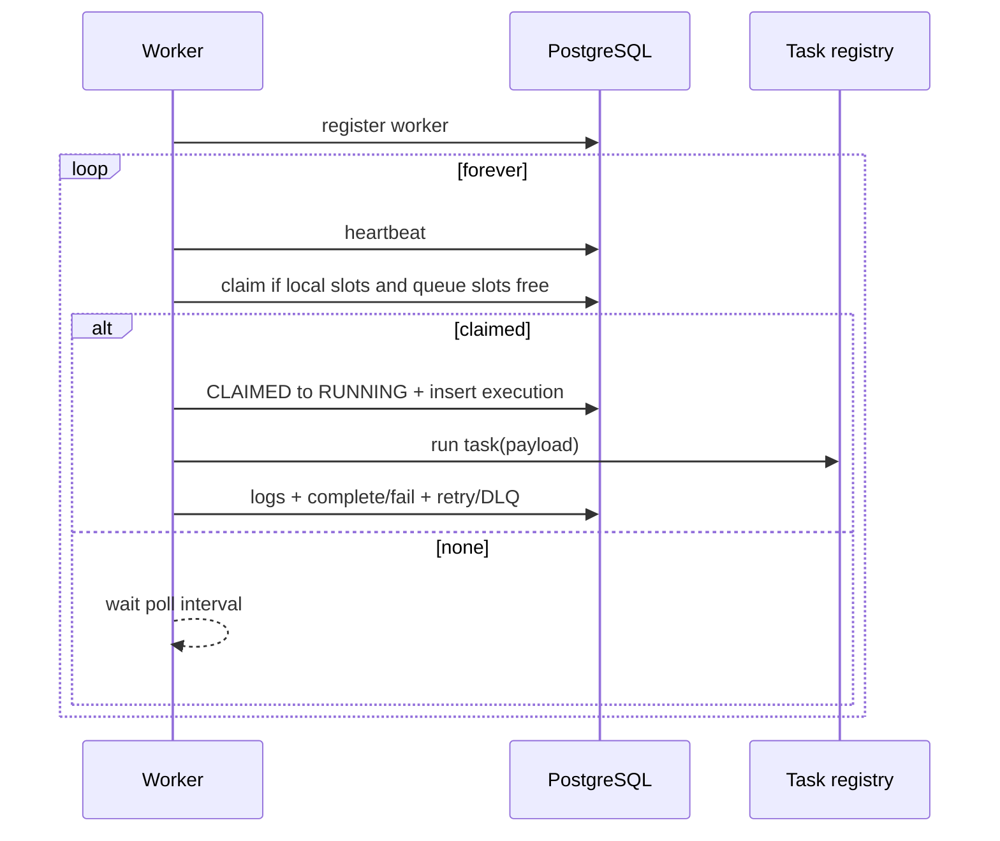

# Worker design

Standalone process: `python -m app.worker`. Many replicas allowed.

## Configuration (env)

| Variable | Meaning |
| --- | --- |
| WORKER_ID | UUID; generated and persisted locally if unset |
| POLL_INTERVAL_SECONDS | Idle poll backoff (not the scheduler) |
| HEARTBEAT_INTERVAL_SECONDS | Beat period |
| MAX_CONCURRENCY | Process-level asyncio task cap |
| GRACEFUL_SHUTDOWN_TIMEOUT_SECONDS | Drain then abort |
| JOB_LEASE_SECONDS | `lease_expires_at` extension while running |
| QUEUE_IDS / PROJECT scope | Optional subscription |

Sleep is only used for **idle polling and heartbeats**, not as the job clock. Due work is determined by `run_after` in PostgreSQL.

## Runtime loop

- **Register** worker row; unique `id`.
- **Heartbeat** updates `workers` and inserts `worker_heartbeats`.
- **Claim** uses `FOR UPDATE SKIP LOCKED` (see job-lifecycle).
- **Execute** via asyncio `TaskGroup` / semaphore: `min(MAX_CONCURRENCY, remaining queue slots)`.
- **Tasks** are a registry: `echo`, `http_request`, `sleep_test`, `email_sim`, `data_process_sim`. Unknown `task_name` → fail the job (retry/DLQ policy). **No** `eval` / user Python.
- **Shutdown:** stop claiming, wait up to timeout, then mark remaining as abandoned (lease expiry / recoverer). Heartbeat status `DRAINING` then `OFFLINE`.

## Queue concurrency

Process semaphore ≠ queue limit. A queue with `concurrency_limit=5` across 4 workers still allows at most 5 `CLAIMED`+`RUNNING` globally, enforced in the database (queue runtime counter).

## Heartbeats and health

A worker is **unhealthy/offline** if `last_heartbeat_at < now() - HEARTBEAT_TTL`. API lists workers with derived health. Recoverer uses the same TTL plus `lease_expires_at`.

## Failure recovery (at-least-once)

If a worker dies after CLAIMED/RUNNING:

1. Heartbeats stop; lease is not extended.
2. Recoverer (scheduler sidecar, `FOR UPDATE SKIP LOCKED` on jobs where `status IN ('CLAIMED','RUNNING') AND lease_expires_at < now()`):
   - If worker is unhealthy **and** lease expired → set `QUEUED`, clear `worker_id`, increment a `recovery_count` (metrics).
   - Do **not** recover if heartbeat is fresh and lease is extended (healthy long job).

Workers extend `lease_expires_at` on heartbeat while they still hold the job.

**Duplicate execution window:** between last lease extension and crash, another worker may later run the same job. Tasks should be written to tolerate duplicates (HTTP with idempotency headers where possible). This is at-least-once, not exactly-once.

## Scheduler

Separate process. Periodically (and/or `LISTEN/NOTIFY`):

1. `SELECT … FOR UPDATE SKIP LOCKED` on `scheduled_jobs` where `enabled AND next_run_at <= now()`.
2. Insert child job `QUEUED` or flip delayed job `SCHEDULED` → `QUEUED`.
3. Insert `schedule_fires (scheduled_job_id, fire_at)` unique; conflict → skip (no duplicate cron job).
4. Compute next `next_run_at` from cron in UTC (optional timezone stored).

Delayed jobs are ordinary jobs in `SCHEDULED` with `run_after`; scheduler only promotes them—it does not execute payloads.
